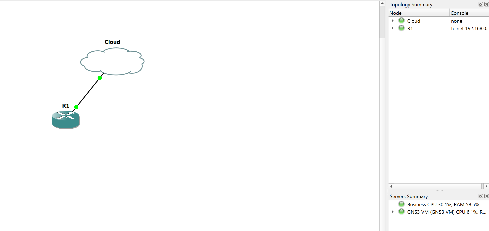
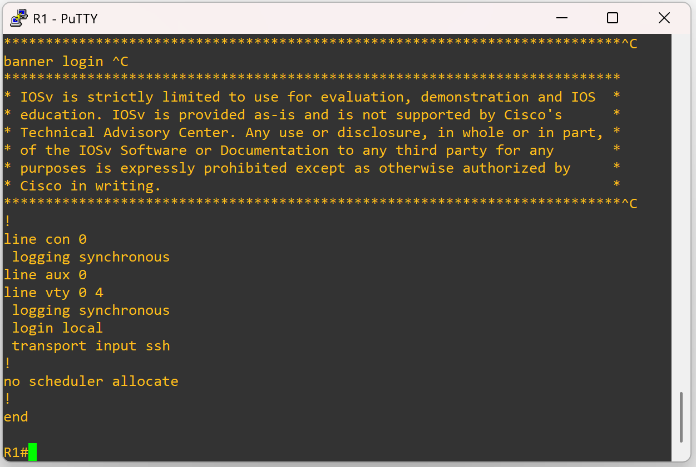
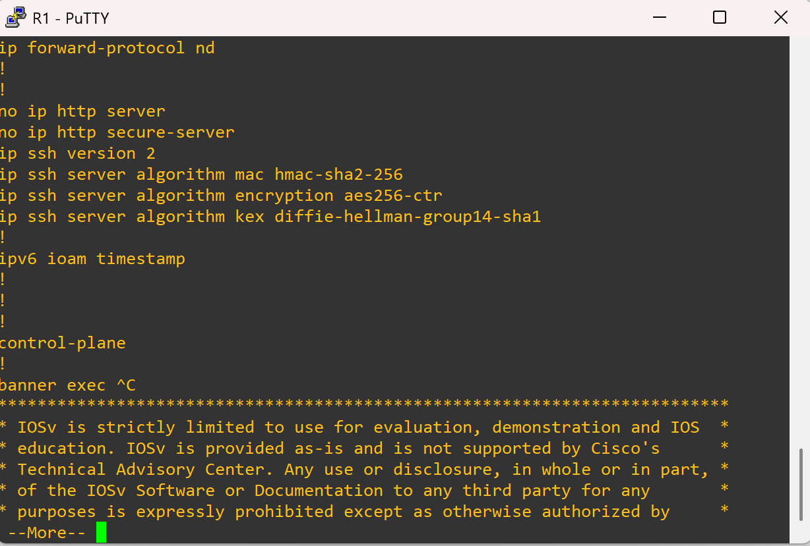
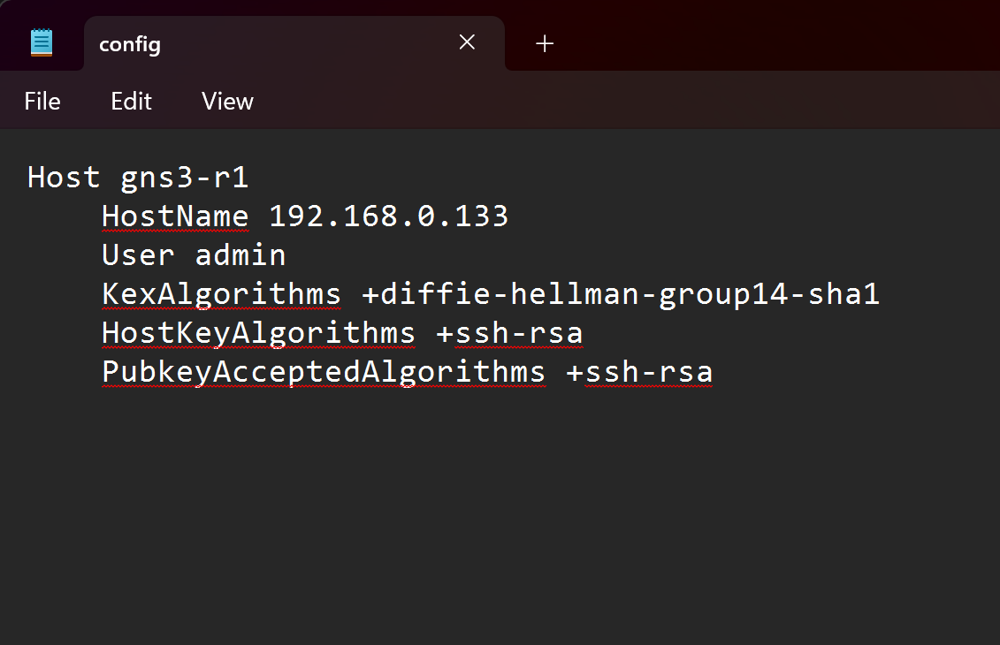
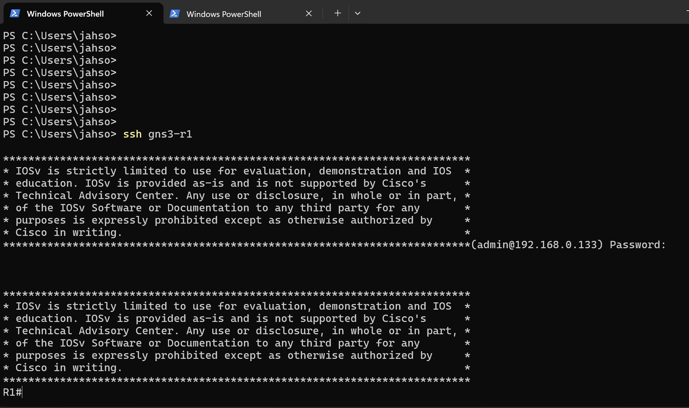
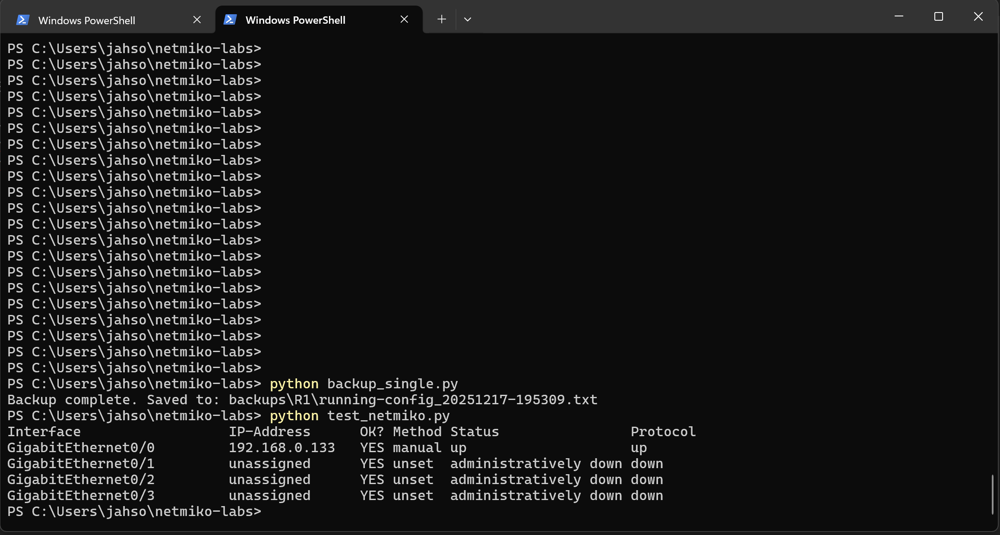
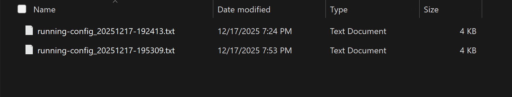
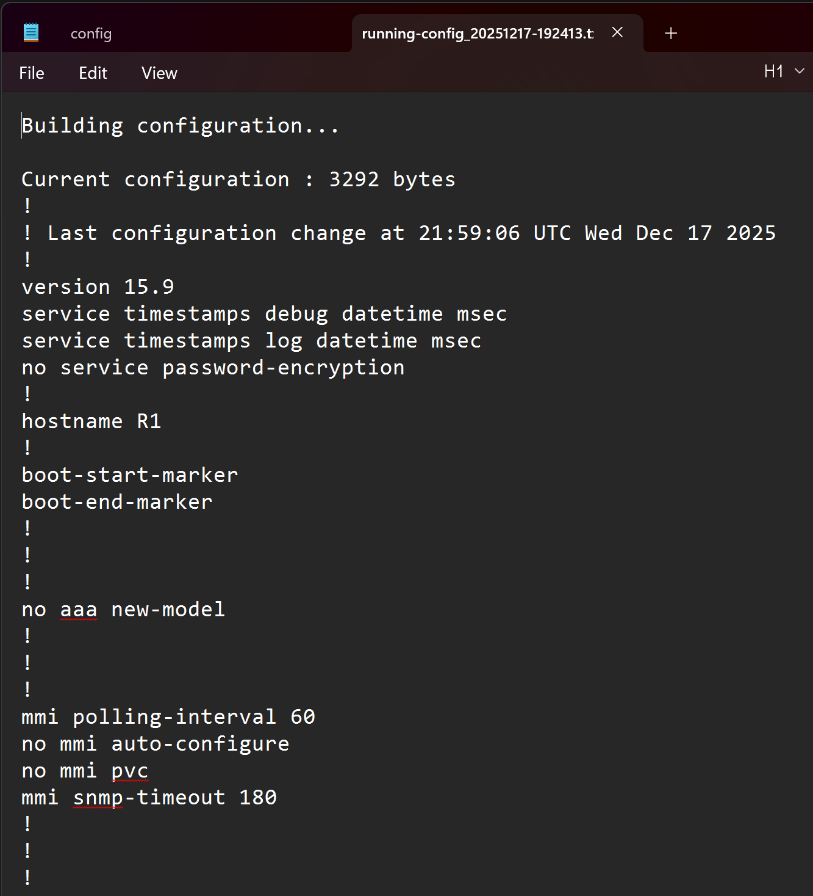
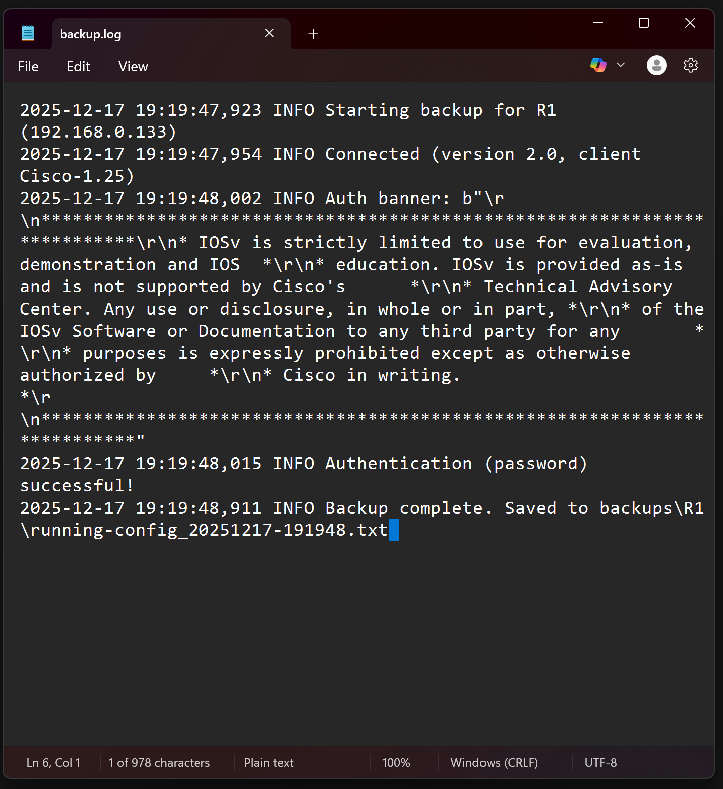

# ⚙️ Network Automation Lab – Cisco Config Backup with Netmiko

## 📌 Overview

This lab demonstrates basic network automation using **Python and Netmiko** to back up the running configuration of a Cisco router. The project focuses on automating a common operational task in a safe, repeatable way while handling real-world challenges such as SSH compatibility and authentication issues.

The environment was built using **GNS3** with a **Cisco IOS router image and a cloud node deployed on the GNS3 VM running on VMware Workstation Pro**. The lab could not be reliably executed using the local PC server, so the GNS3 VM was used to ensure proper networking and device communication. Automation was executed from a **Windows 11 host**, reflecting a common real-world setup where engineers manage virtualized network infrastructure from an endpoint system.

---

## 🎯 Objectives

* Establish secure SSH connectivity to a Cisco router
* Automate device access using Python and Netmiko
* Retrieve and store running configurations
* Save timestamped backups for auditing and rollback
* Troubleshoot common SSH and automation issues

---

## 🧪 Lab Environment

* **Emulation Platform:** GNS3
* **Network Devices:** Cisco IOSv Router
* **Virtualization:** GNS3 VM on VMware Workstation Pro
* **Automation Host:** Windows 11
* **Python Version:** 3.x
* **Libraries:** Netmiko, Paramiko
* **Access Method:** SSH

---

## 🧠 Skills Demonstrated

* Cisco IOS configuration and SSH setup
* Windows OpenSSH client configuration
* Handling legacy SSH cryptographic compatibility
* Python scripting for network automation
* Netmiko-based device interaction
* Structured file and log management
* Real-world troubleshooting and problem isolation

---

## 🔐 SSH Compatibility Note

The Cisco IOS image used in this lab supports only older SSH algorithms (`diffie-hellman-group14-sha1` and `ssh-rsa`). Modern OpenSSH clients disable these algorithms by default.

To address this securely, a **per-host SSH configuration** was used to allow legacy algorithms **only for the lab router**, avoiding global SSH security changes. This mirrors how legacy devices are commonly handled in enterprise environments.

---

## 📁 Project Structure

```
netmiko-labs/
├── backup_single.py
├── test_netmiko.py
├── backups/
│   └── R1/
│       └── running-config_YYYYMMDD-HHMMSS.txt
├── logs/
│   └── backup.log
└── README.md
```

---

## 🛠️ Script Descriptions

### 🔹 test_netmiko.py

Validates SSH connectivity and authentication by running a basic `show ip int brief` command against the router.

### 🔹 backup_single.py

* Establishes an SSH session using Netmiko
* Executes `show running-config`
* Saves output to a timestamped file
* Logs execution details for auditing

---

## ▶️ How to Run

1. Install dependencies:

   ```
   python -m pip install netmiko
   ```

2. Navigate to the project directory:

   ```
   cd netmiko-labs
   ```

3. Test connectivity:

   ```
   python test_netmiko.py
   ```

4. Run the backup script:

   ```
   python backup_single.py
   ```

A new configuration backup will be created in the `backups/R1/` directory.

---

## 🧩 Troubleshooting and Challenges Encountered

### 1️⃣ SSH Key Exchange Algorithm Mismatch

**Issue:** SSH failed due to unsupported key exchange algorithms.
**Cause:** IOSv supports only legacy SSH algorithms disabled by default in modern clients.
**Resolution:** A scoped SSH configuration was created to allow legacy algorithms for this host only.

---

### 2️⃣ OpenSSH Client Availability on Windows

**Issue:** SSH commands were initially unavailable.
**Cause:** OpenSSH Client was not fully enabled or available in PATH.
**Resolution:** Verified and enabled OpenSSH via PowerShell and restarted the terminal.

---

### 3️⃣ SSH Config File Path and Naming Issues

**Issue:** SSH host alias was not recognized.
**Cause:** Incorrect file path or filename (`config.txt` instead of `config`).
**Resolution:** Verified the `.ssh` directory and created a correctly named config file.

---

### 4️⃣ PowerShell Command Parsing Errors

**Issue:** SSH commands failed due to PowerShell syntax errors.
**Cause:** Differences between PowerShell and Command Prompt syntax.
**Resolution:** Used the PowerShell call operator (`&`) and proper environment variables.

---

### 5️⃣ Python Script File Path Errors

**Issue:** Python could not locate the script file.
**Cause:** Script was executed from the wrong directory.
**Resolution:** Standardized execution from the project directory.

---

### 6️⃣ Netmiko Module Not Installed

**Issue:** `ModuleNotFoundError` for Netmiko.
**Cause:** Netmiko was not installed in the active Python environment.
**Resolution:** Installed using `python -m pip install netmiko`.

---

### 7️⃣ Netmiko Authentication Failure

**Issue:** Netmiko failed authentication while manual SSH worked.
**Cause:** Incorrect password defined in the Python script.
**Resolution:** Updated the script credentials to match the router’s local user account.

---

## ✅ Results

* Successful automated SSH authentication
* Running configuration retrieved programmatically
* Timestamped backups stored locally
* Execution logged for traceability

---

## 📈 Lessons Learned

* Legacy infrastructure often requires scoped compatibility adjustments
* Automation should run independently of manual CLI sessions
* Small credential mismatches can cause automation failures
* Proper logging and structure improve reliability and debuggability

---

## 🚀 Future Enhancements

* Multi-router inventory support
* Configuration comparison (diff)
* Secret masking in backups
* Scheduled backups
* Centralized logging

### 📸 Screenshot 1 – GNS3 Topology

**Caption:**
GNS3 lab topology showing the Cisco IOS router connected through a cloud node hosted on the GNS3 VM running in VMware Workstation Pro. This setup was required to ensure reliable network connectivity, as the local PC server was insufficient for this lab.



---


### 📸 Screenshot 2 – Router SSH Configuration

**Caption:**
Cisco IOS SSH configuration confirming that SSH is enabled on the router and VTY lines are configured to allow remote access using the local user database.
  

 
  

### 📸 Screenshot 3 – Windows SSH Per-Host Configuration

**Caption:**
Windows OpenSSH per-host configuration allowing legacy SSH algorithms for the lab router only. This approach maintains secure global SSH defaults while enabling compatibility with the IOSv image.
  

### 📸 Screenshot 4 – Manual SSH Connectivity Test

**Caption:**
Successful manual SSH login from the Windows automation host to the Cisco router, validating basic connectivity and credentials prior to automation.
  

### 📸 Screenshot 5 – Script execution
**Caption:**
Execution of the Netmiko-based automation script retrieving the router’s running configuration and confirming successful backup completion. Output from a Netmiko test script executing a `show ip interface brief` command, confirming successful programmatic SSH access and command execution.

  

### 📸 Screenshot 6 – Backup File Creation

**Caption:**
File system view showing timestamped configuration backups stored in a structured directory, demonstrating persistence and auditability.
  

---

### 📸 Screenshot 7 – Running Configuration Sample

**Caption:**
Excerpt from the saved running configuration file generated by the automation script. Sensitive information is masked to maintain security best practices.
  

### 📸 Screenshot 8 – Automation Log Output

**Caption:**
Log file generated by the automation script capturing timestamps and execution status, providing traceability and operational visibility
  
