# Syslog and SNMP Monitoring Lab (Cisco Packet Tracer)

## Overview

This lab demonstrates the implementation of **Syslog** and **SNMP** in a Cisco network to support centralized monitoring, event logging, and remote management. Using a pre-built Cisco Packet Tracer topology, I extended the lab by configuring Syslog and SNMP on both HQ and Branch routers to simulate how network and system administrators monitor devices and perform management tasks across an enterprise network.

The lab is divided into two phases: Syslog configuration and verification, followed by SNMP configuration and management operations.

---

## Lab Topology Summary

* **HQ LAN subnet:** 192.168.1.0/24
* **Syslog Server:** 192.168.1.5 (located on HQ LAN)
* **Branch LAN subnet:** 172.16.1.0/24
* **SNMP Manager:** Installed on a PC within the Branch LAN
* **Devices:** HQ Router and Branch Router

---

## Phase 1 – Syslog Configuration and Verification

In Phase 1, Syslog was configured on both the HQ and Branch routers to send log messages to a centralized Syslog server located on the HQ LAN.

### Configuration Steps

* Enabled Syslog on both routers using:

  * `logging 192.168.1.5`
  * `logging trap debugging`
  * `service timestamps datetime msec`
* Verified Syslog configuration using `show logging` on the HQ router
* Confirmed correct logging destination and severity levels

### Log Generation Test

To validate Syslog functionality, I deliberately shut down the Branch router’s LAN interface to generate system events. These events were successfully forwarded and recorded on the Syslog server, confirming proper configuration and end-to-end logging.

---

## Phase 2 – SNMP Configuration and Management

In Phase 2, SNMP was configured on both routers to allow centralized monitoring and remote management using an SNMP Manager application.

### SNMP Agent Configuration

SNMP agents were enabled on both the HQ and Branch routers using:

* `snmp-server community public ro`
* `snmp-server community private rw`

This allowed read-only and read-write access for monitoring and configuration changes.

### SNMP Operations Performed

Using the SNMP Manager GUI on the Branch LAN PC:

* Sent an SNMP **GET** request to the Branch router (172.16.1.1) to retrieve system uptime after identifying the correct OID from the MIB
* Successfully received the uptime value from the router
* Sent an SNMP **SET** request to modify the Branch router hostname

  * Original hostname: `Branch-A`
  * Updated hostname: `Branch-A-RTR`

These actions confirmed that SNMP was functioning correctly for both monitoring and configuration management.

---

## Key Takeaways

* Syslog enables centralized visibility into network events and device status
* SNMP allows administrators to monitor device metrics and make controlled configuration changes remotely
* Syslog and SNMP are often used together in enterprise environments to provide both event-driven logging and structured device management
* Centralized monitoring improves troubleshooting efficiency and operational awareness

---

## Tools and Technologies Used

* Cisco Packet Tracer
* Cisco IOS
* Syslog Server
* SNMP Manager Application
* MIB and OID identification

---

## Skills Demonstrated

* Cisco IOS Syslog configuration and verification
* SNMP agent configuration and management
* Understanding of RO vs RW SNMP communities
* Centralized monitoring concepts
* Practical troubleshooting and validation techniques

### Network Topology 

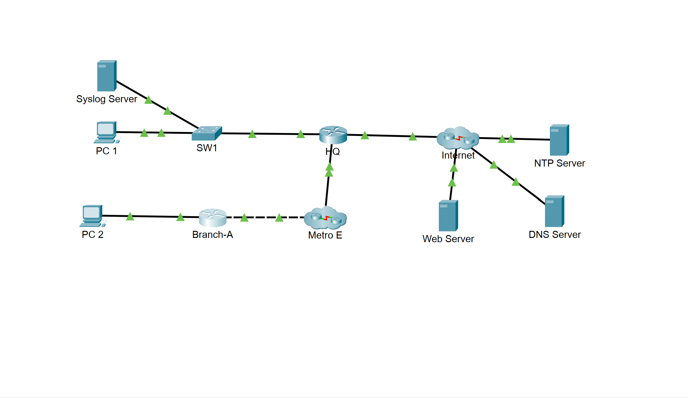

---

### 📸 syslog

**Description:**
Initial view of the Syslog server interface, confirming the Syslog service is running and ready to receive log messages from network devices.
  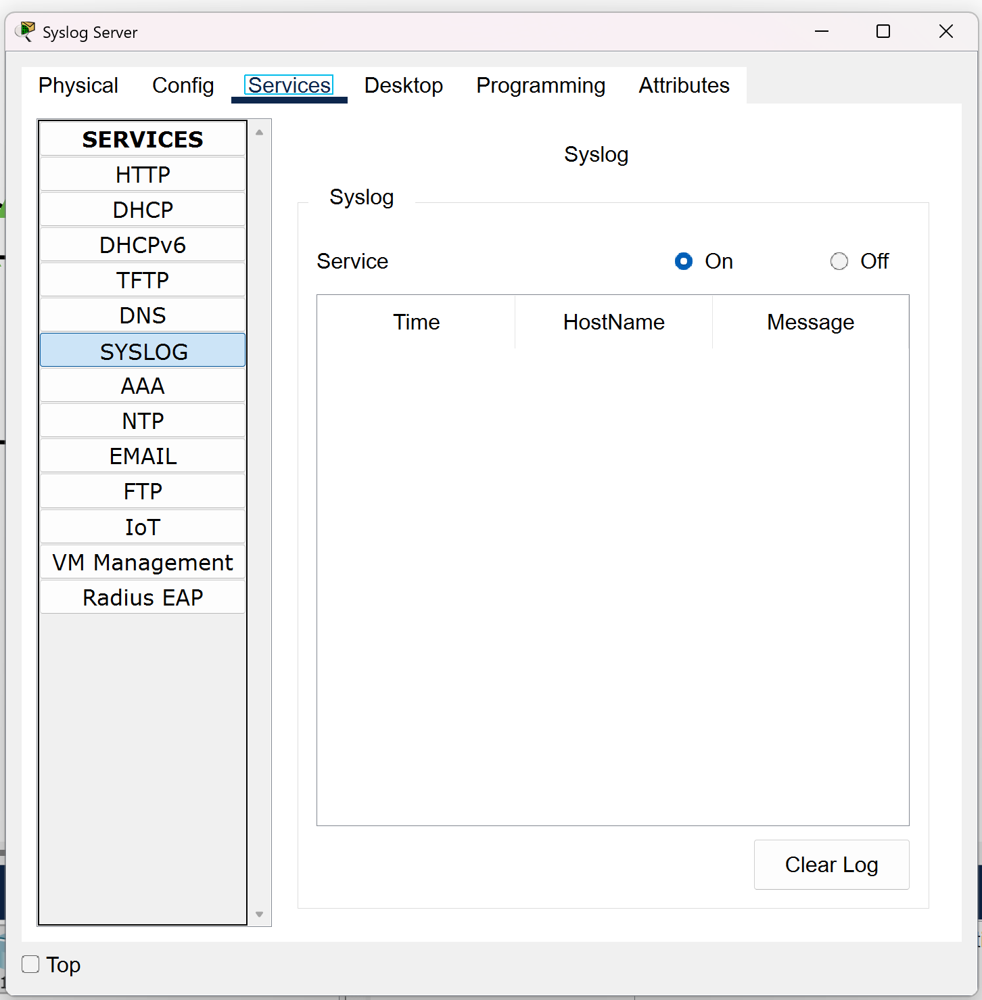

### 📸 branch-syslog-config

**Description:**
Syslog configuration on the Branch router showing the logging host address, logging severity level, and timestamp configuration used to forward logs to the centralized Syslog server.
  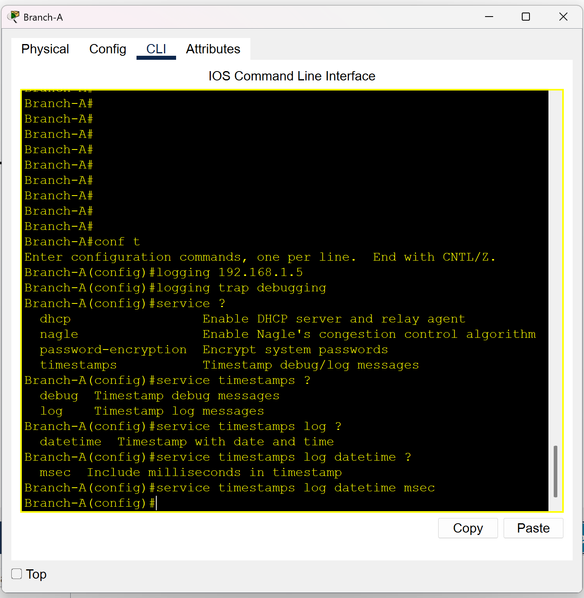

---

### 📸 branch-int-shut

**Description:**
Branch router LAN interface being administratively shut down to intentionally generate Syslog events for testing and verification purposes.

  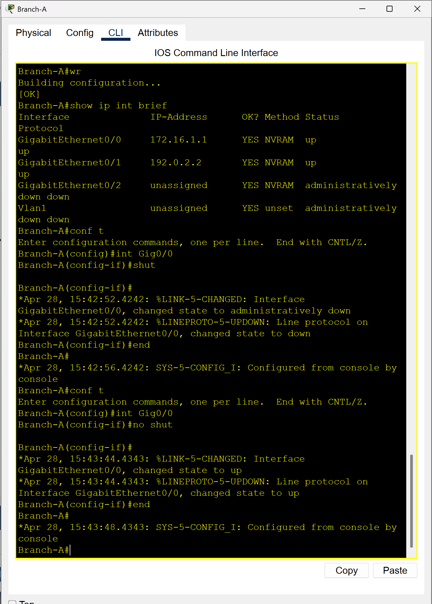

### 📸 syslog-messages

**Description:**
Syslog server output displaying received log messages generated by the Branch router interface shutdown, confirming successful end-to-end Syslog communication.
  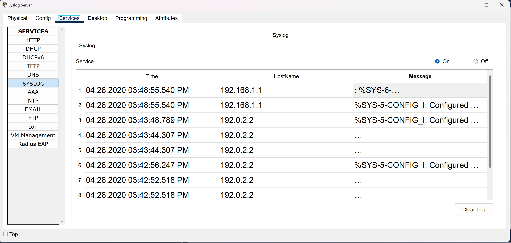

### 📸 show-logging

**Description:**
Output of the `show logging` command on the HQ router verifying Syslog settings, logging destination, and active logging status.

  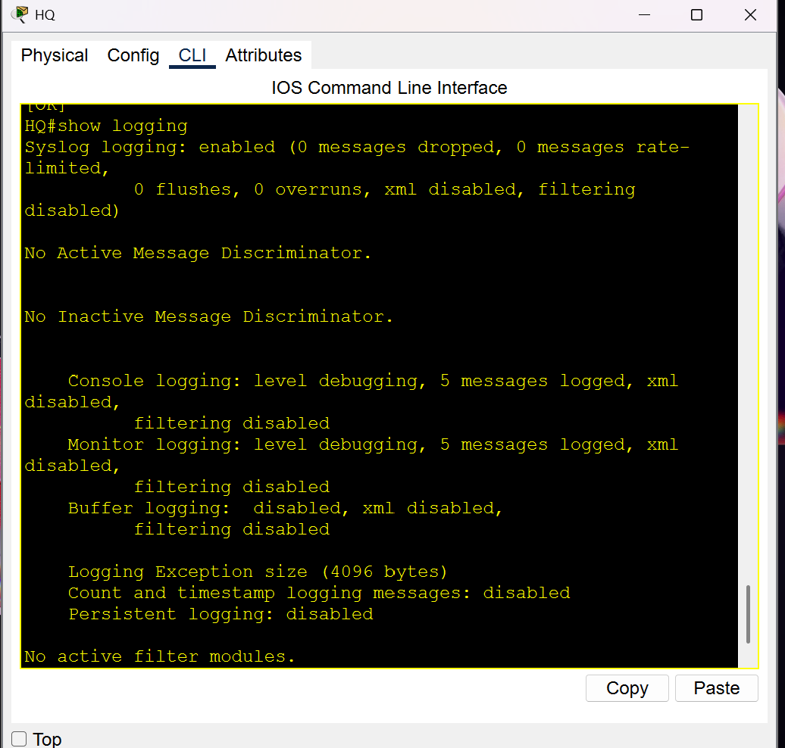

### 📸 hq-snmp-config

**Description:**
SNMP configuration on the HQ router showing read-only and read-write community strings configured to enable SNMP monitoring and management.

  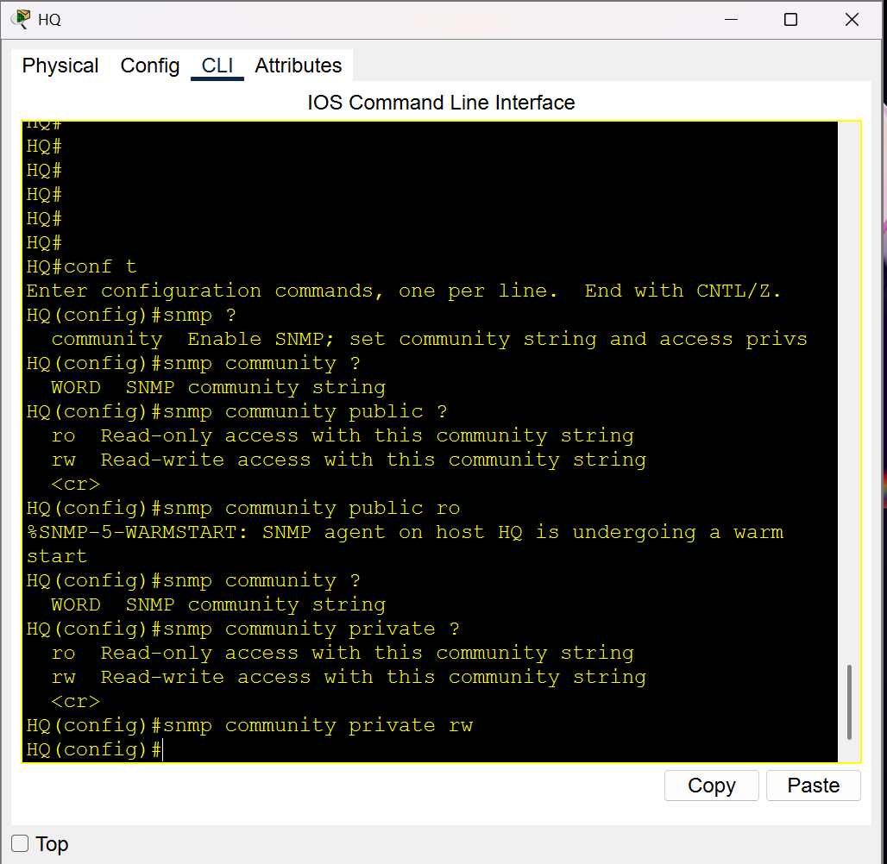

---

### 📸 pc2-snmp-manager

**Description:**
SNMP Manager application interface running on the Branch LAN PC, used to send SNMP GET and SET requests to network devices.
  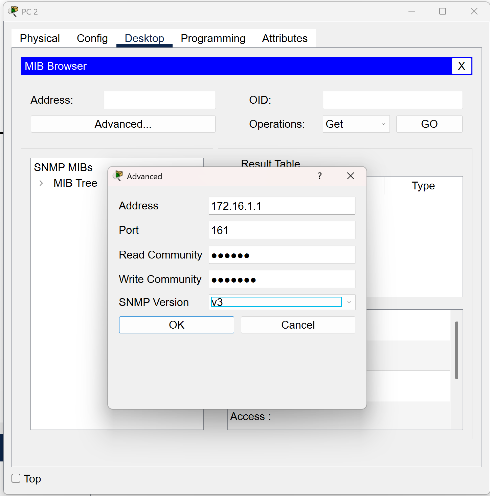

### 📸 get-message-sysuptime

**Description:**
Successful SNMP GET request retrieving the Branch router’s system uptime using the appropriate OID from the MIB.
  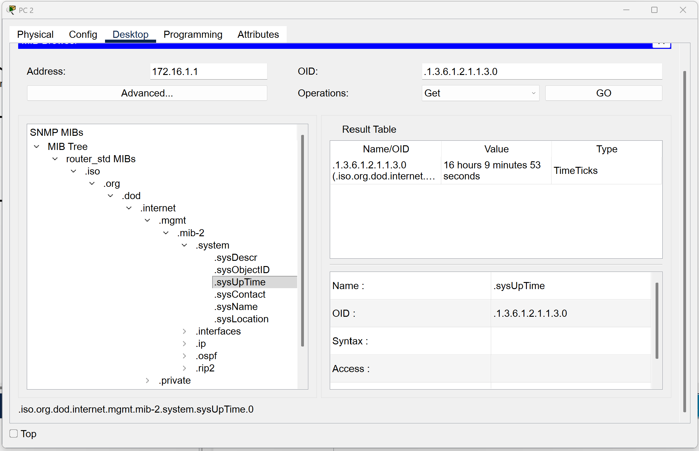

### 📸 set-command-name-change

**Description:**
SNMP SET operation issued from the SNMP Manager to modify the Branch router’s hostname using a read-write community string.
  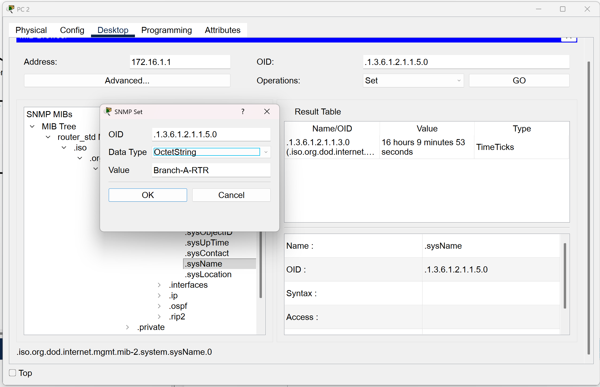

---
### 📸 branch-name-observed

**Description:**
Verification on the Branch router confirming the hostname change applied successfully via SNMP, demonstrating remote configuration management.
  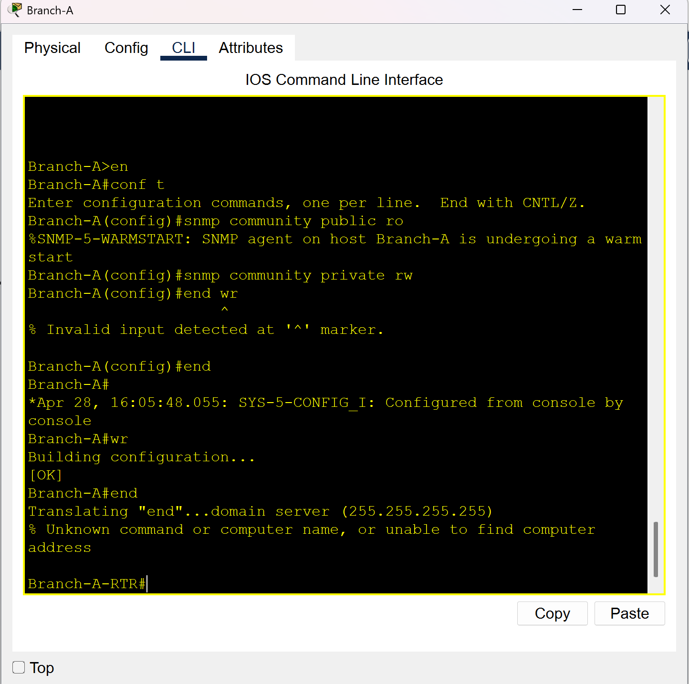

---
