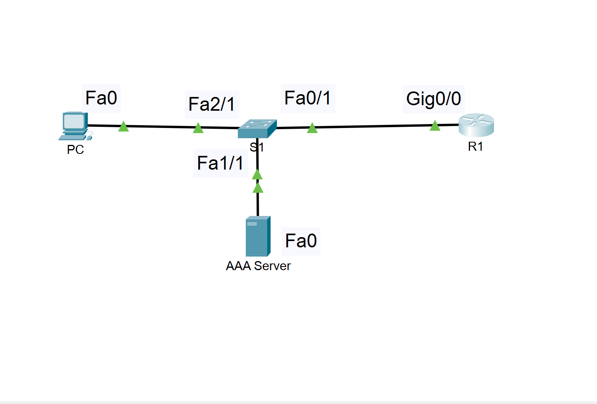
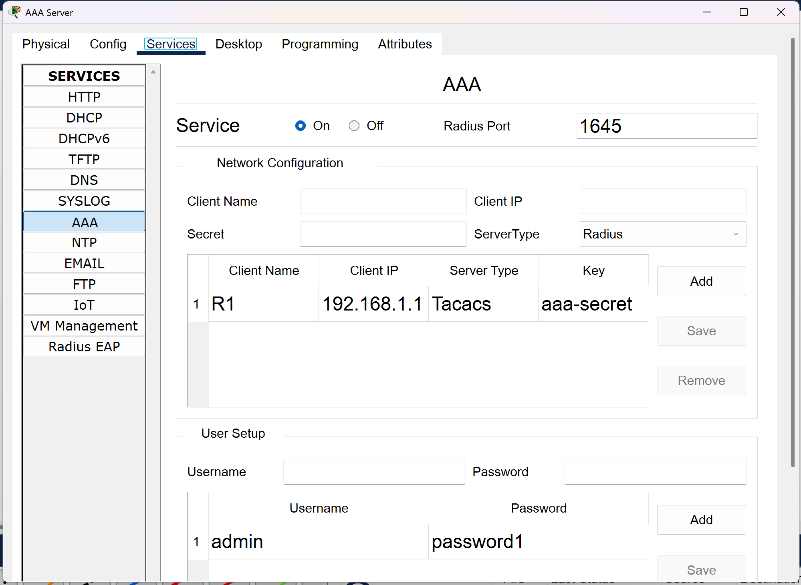
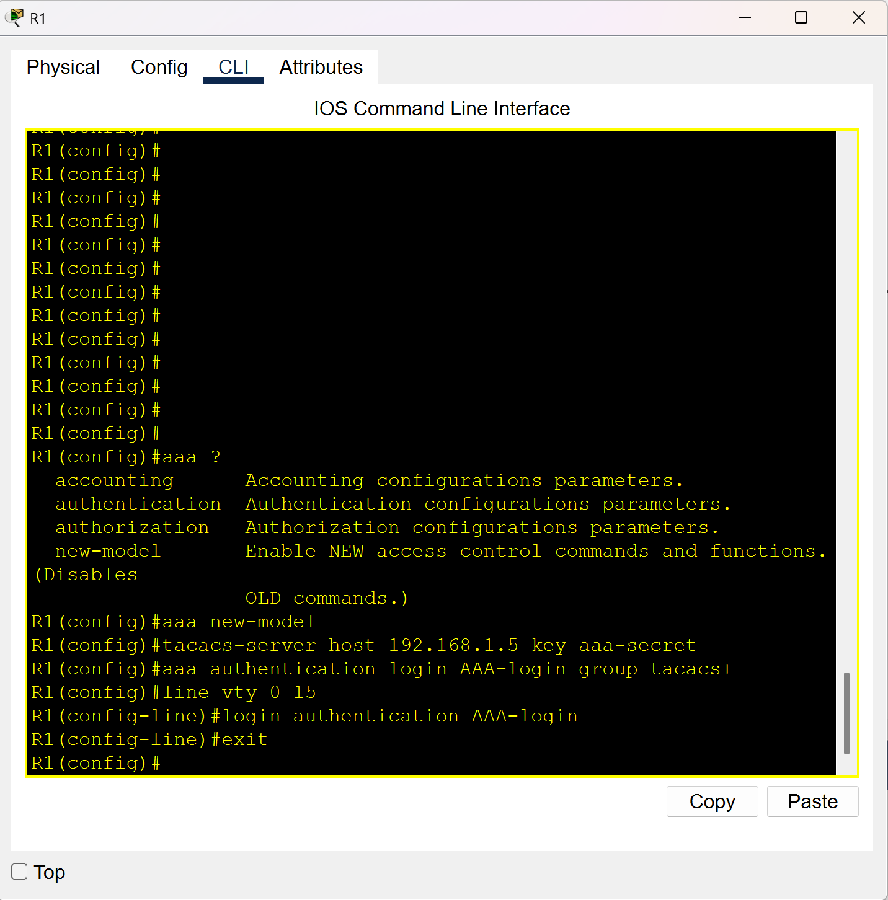
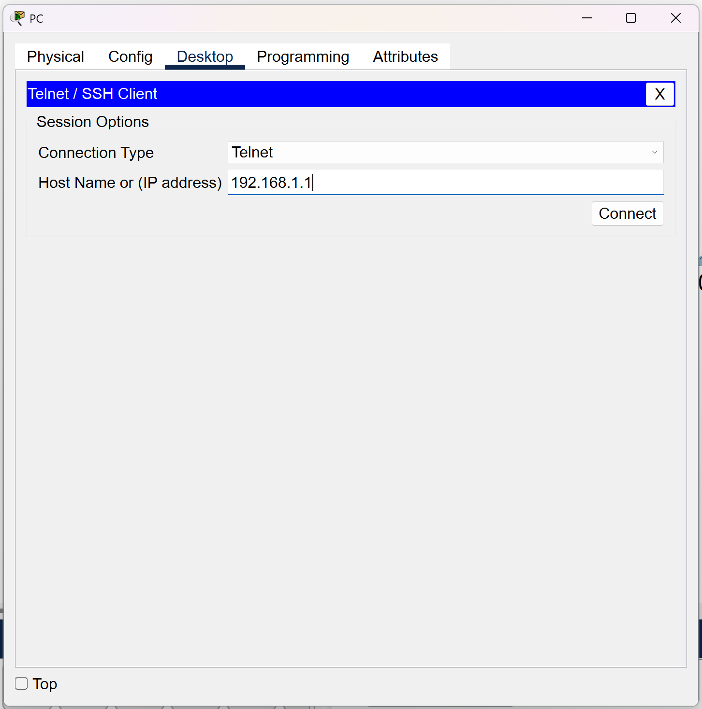
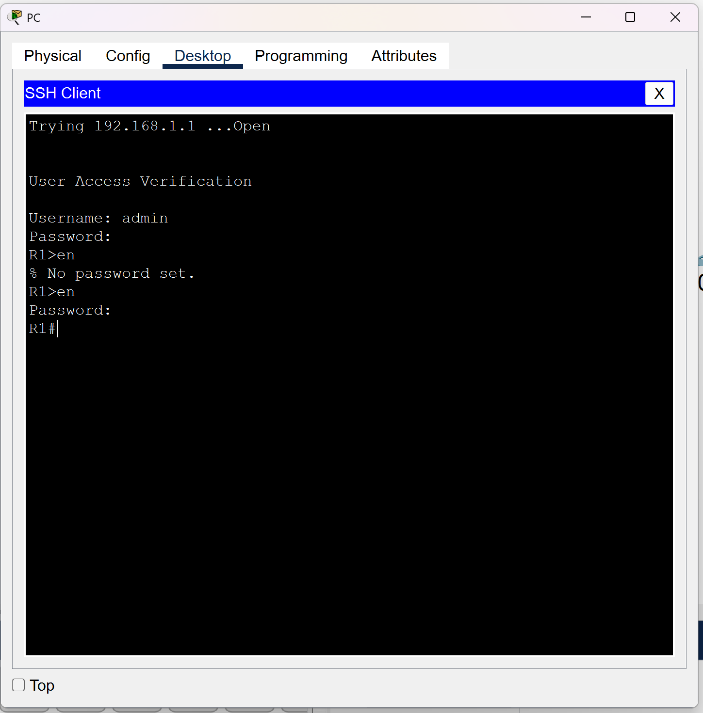
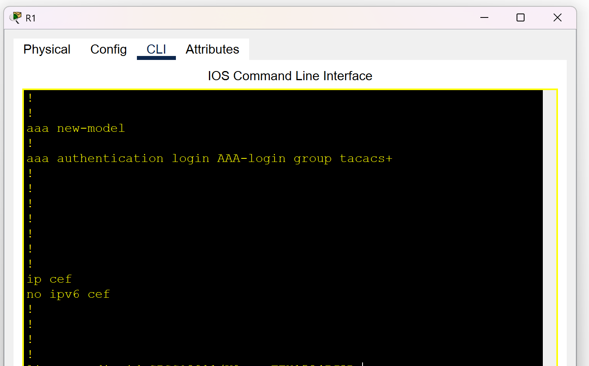
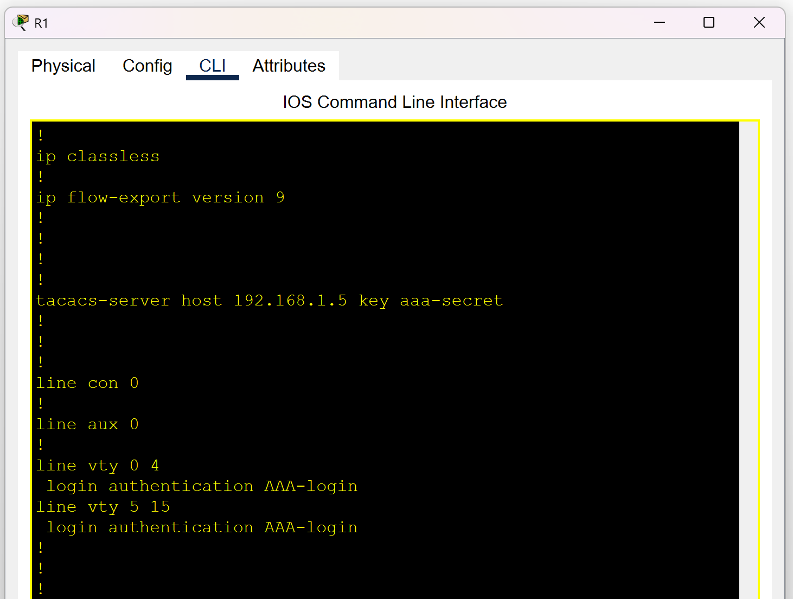

# Tacacs Lab – Cisco Packet Tracer

This project demonstrates a simple **AAA (Authentication, Authorization, and Accounting)** lab using **Cisco Packet Tracer**. The goal was to show how a router can authenticate administrative access using a centralized **TACACS+ AAA server** instead of local credentials.

---

## 🧪 Lab Topology

The lab consists of four devices connected through a Layer 2 switch:

| Device | Interface | IP Address | Description |
|--------|-----------|------------|-------------|
| **Router (R1)** | Gig0/0 | `192.168.1.1` | TACACS+ client |
| **AAA Server** | Fa0 | `192.168.1.5` | TACACS+ server |
| **PC** | Fa0 | `192.168.1.10` | Telnet client |
| **Switch** | Fa0/1, 1/1, 2/1 | — | Layer 2 connectivity |

All devices reside in the **192.168.1.0/24** network.

The enable secret is cisco123 on R1
---

## ✅ Step 1: Verify Basic Connectivity

Before configuring AAA, I confirmed that all devices could reach each other using `ping`:

- PC → AAA Server  
- PC → Router  
- Router → AAA Server  

Once connectivity was confirmed, I moved on to configuring the AAA server.

---

## ✅ Step 2: Configure the AAA Server (Packet Tracer GUI)

Inside the AAA server:

1. Enabled **AAA Services**  
2. Selected **TACACS+** as the server type  
3. Added a new client:  
   - **Client Name:** R1  
   - **Client IP:** `192.168.1.1`  
   - **Key:** `aaa-secret`  
4. Created a local user:  
   - **Username:** `admin`  
   - **Password:** `password1`

This prepares the server to authenticate router logins.

---

## ✅ Step 3: Configure AAA on Router R1

On R1, I enabled AAA and pointed it to the TACACS+ server:

```cisco
aaa new-model
tacacs-server host 192.168.1.5 key aaa-secret
aaa authentication login AAA-login group tacacs+

line vty 0 15
 login authentication AAA-login
```

This configuration tells R1:

- Use TACACS+ for login authentication  
- Use the method list named **AAA-login**  
- Apply it to all VTY (Telnet/SSH) lines  

---

## ✅ Step 4: Test Authentication from the PC

From the PC, I initiated a **Telnet session** to R1:

```
telnet 192.168.1.1
```

When prompted, I entered the TACACS+ credentials:

- **Username:** admin  
- **Password:** password1  

Authentication succeeded, confirming that R1 was correctly using the AAA server for login validation.

---

## ✅ Step 5: Verification on R1

Finally, I used `show` commands on R1 to verify the configuration:

```cisco
show running-config | section aaa
show running-config | section tacacs
show running-config | section vty
```

These outputs confirmed that AAA, TACACS+, and VTY authentication were configured as expected.

## 📸 Screenshots

### **topology.png**  
  
Shows the full Packet Tracer topology connecting the PC, AAA server, switch, and R1 in the 192.168.1.0/24 network.

### **AAA-server-config.png**  
  
Displays the AAA server’s TACACS+ configuration, including client settings and user credentials.

### **r1-aaa-config.png**  
  
Shows the AAA and TACACS+ configuration applied on Router R1.

### **telnet-client.png**  
  
Captures the PC initiating a Telnet session to R1 using TACACS+ authentication.

### **telnet-success.png**  
  
Confirms successful TACACS+ login to R1 with the configured admin credentials.

### **show-run-aaa.png**  
  
Displays R1’s running configuration section related to AAA.

### **show-run-tacacs.png**  
  
Displays R1’s running configuration section related to TACACS+ server and vty settings.
---

## 📘 Summary

This lab demonstrates:

- How to configure a TACACS+ AAA server in Packet Tracer  
- How to integrate a router with centralized AAA  
- How to authenticate remote access using Telnet  
- How to verify AAA and TACACS+ configuration on a Cisco router  

It’s a simple but effective introduction to AAA concepts and a great foundation for more advanced security labs.
