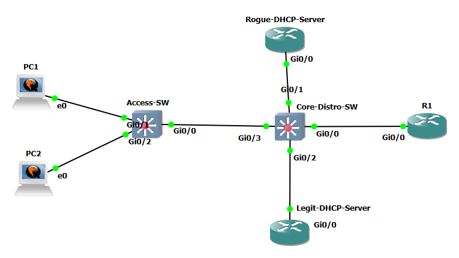
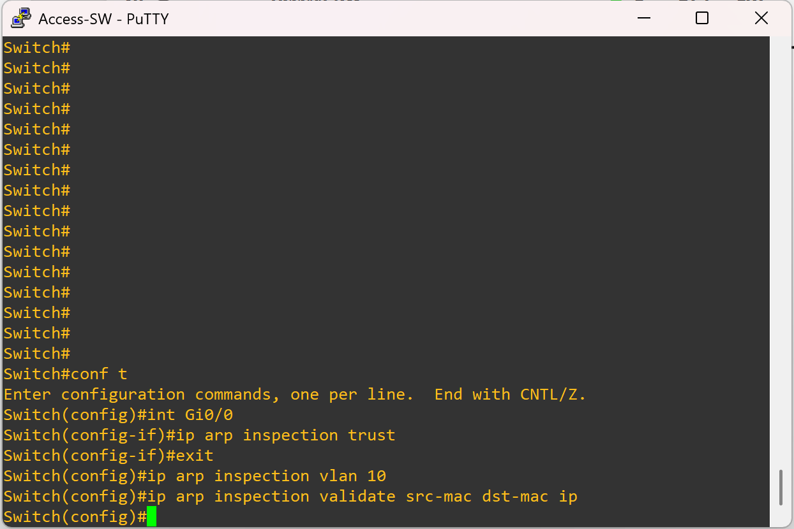
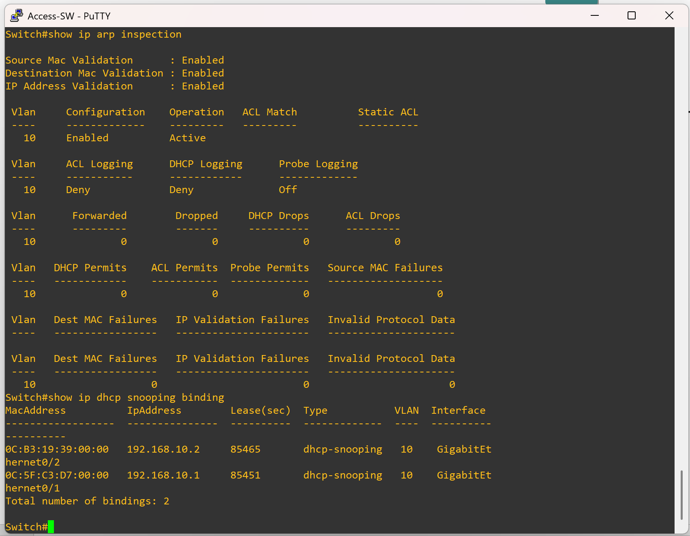
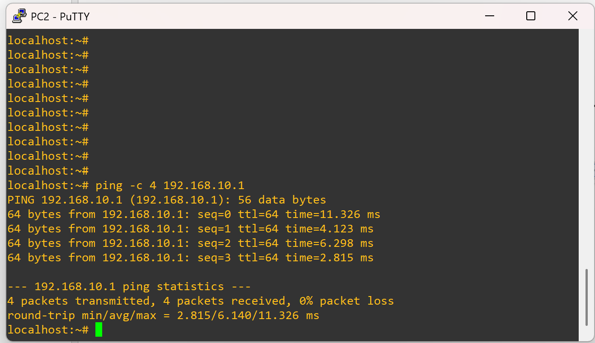
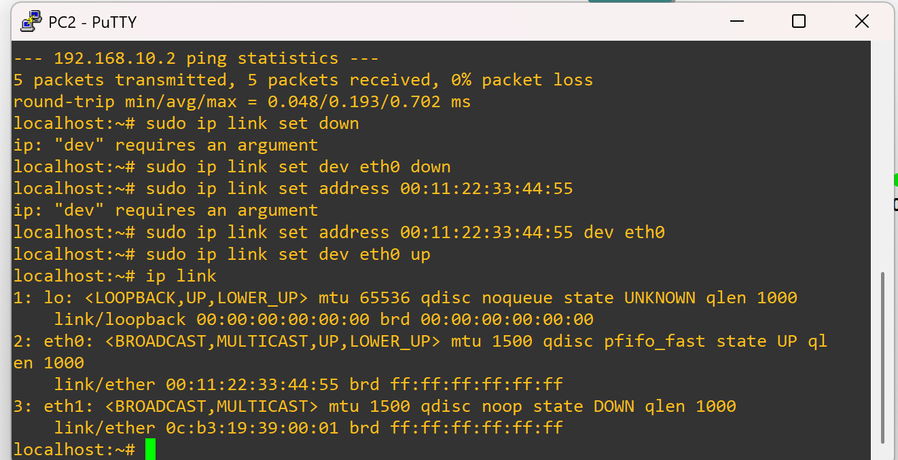
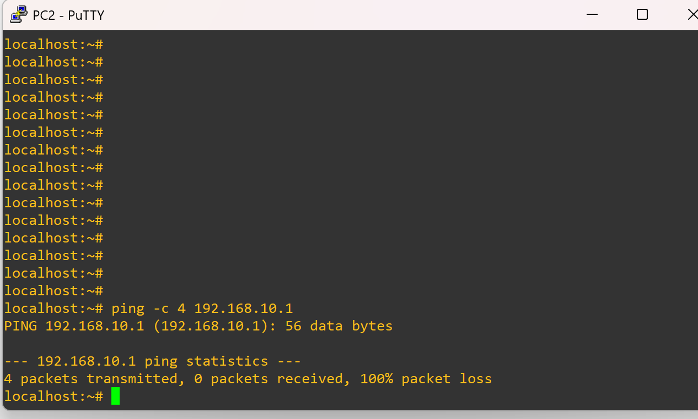
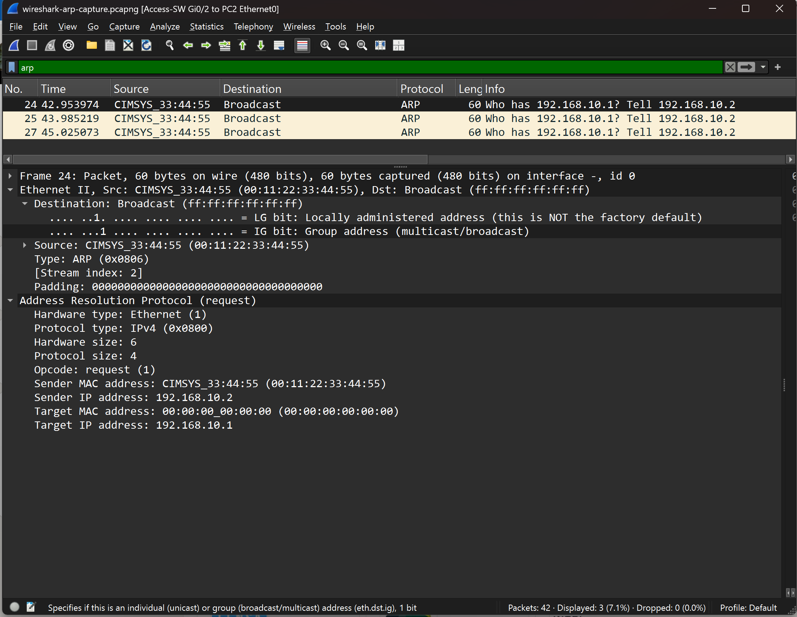
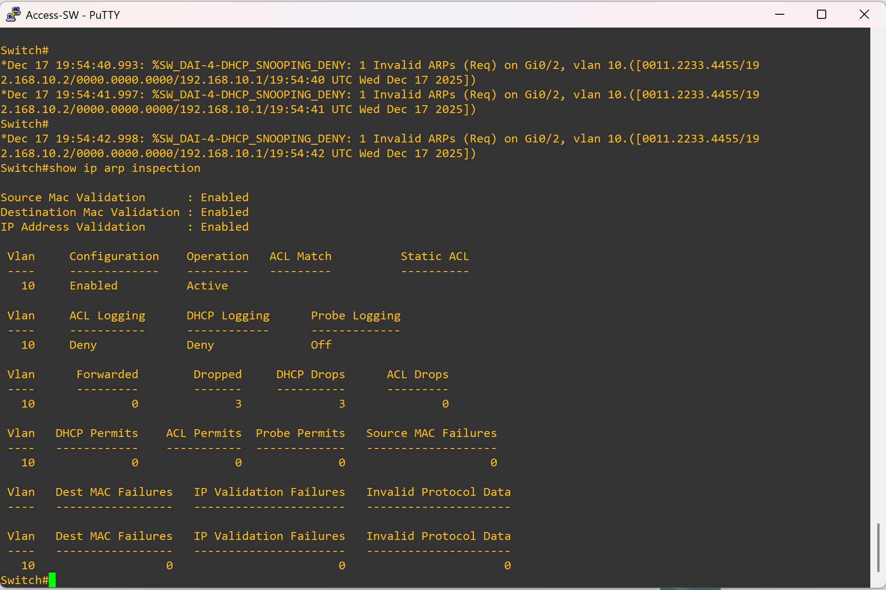

### DAI + DHCP Snooping Lab

---

### 📖 Overview
This lab builds on the earlier DHCP Snooping experiment by enabling **Dynamic ARP Inspection (DAI)** on both switches and adding the stricter validation command. The objective was to confirm normal ARP/ICMP behavior under proper bindings, then deliberately spoof a client MAC address to observe how DAI enforces protection.

---

### 🖥️ Topology
- **Core Switch**  
  - Legitimate DHCP server (trusted)  
  - Trunk uplink to Access Switch (trusted)  

- **Access Switch**  
  - Uplink to Core (trusted)  
  - **PC1** on Gi0/1 (client)  
  - **PC2** on Gi0/2 (client; later spoofed MAC)  

DHCP Snooping remained configured exactly as in the prior lab.

---

### ⚙️ Configuration Highlights
```cisco
! DHCP Snooping
ip dhcp snooping
ip dhcp snooping vlan 10
no ip dhcp snooping information option

! DAI
ip arp inspection vlan 10
ip arp inspection validate src-mac dst-mac ip

! Trusted interfaces
interface Gi0/3   ! Core trunk
 ip dhcp snooping trust
 ip arp inspection trust

interface Gi0/2   ! DHCP server
 ip dhcp snooping trust
 ip arp inspection trust

! Access ports left untrusted
interface Gi0/1
 switchport mode access
 switchport access vlan 10

interface Gi0/2
 switchport mode access
 switchport access vlan 10
```

---

### 🔎 Purpose of `ip arp inspection validate src-mac dst-mac ip`
This command enforces three checks simultaneously:  
- **src-mac** → ensures the ARP source MAC matches the DHCP Snooping binding.  
- **dst-mac** → ensures the ARP target MAC matches expected forwarding info.  
- **ip** → ensures the IP address matches the binding.  

Together, these prevent MAC/IP spoofing and strengthen ARP validation.

**Why applied on both switches:**  
- **Access switch:** stops spoofed ARP at the edge before it spreads.  
- **Core switch:** adds defense in depth, catching anything that slips through.  
- **Consistency:** both devices enforce the same rules, avoiding asymmetric behavior and simplifying troubleshooting.

---

### 🔬 Phase 1: Baseline
- **Action:** With DAI enabled and correct bindings, ping PC1 from PC2.  
- **Observation:** Ping succeeds; ARP and ICMP traffic flow normally; DAI statistics show no drops; interfaces remain up.  

✅ **Result:** Legitimate traffic passes without issue.

---

### ⚠️ Phase 2: MAC Spoofing
- **Action:** Manually change PC2’s MAC to one not matching its DHCP binding, then ping PC1.  
- **Observation:**  
  - Ping fails; **no ICMP packets forwarded**.  
  - Interface stays **up/up**.  
  - **Level 4 syslog** messages report DAI violations.  
  - `show ip arp inspection statistics` shows ARP drop counters incrementing.  
  - Wireshark captures repeated ARP requests but **no ICMP** leaving the switch.  

❌ **Result:** DAI blocked spoofed ARP packets, preventing resolution and higher‑layer communication.

---

### 🛠️ Verification Commands
```cisco
show ip arp inspection vlan 10
show ip arp inspection statistics
show ip dhcp snooping
show ip dhcp snooping binding
show logging
show interfaces status
show mac address-table
```

---

### Network Topology 



---

### Phase 1 — DAI Config

- DAI config on access-switch 
  

- Baseline ip arp inspections stats
  

- Successful ping from PC2 to PC1
  
---

### Phase 2 — Deliberate mac address change

- Changing the mac address in the CLI  
  

- Failed ping from pc2 to pc1
  

- Arp capture on Wireshark  
  

- DAI stats after violation  
  

---


### ✅ Lessons Learned
- DAI depends on DHCP Snooping bindings; mismatched MAC/IP pairs are dropped.  
- Interfaces can remain physically up while traffic is silently blocked.  
- Syslog and DAI counters provide immediate visibility into enforcement.  
- Applying validation at both edge and core ensures defense in depth and consistent enforcement across the network.  
