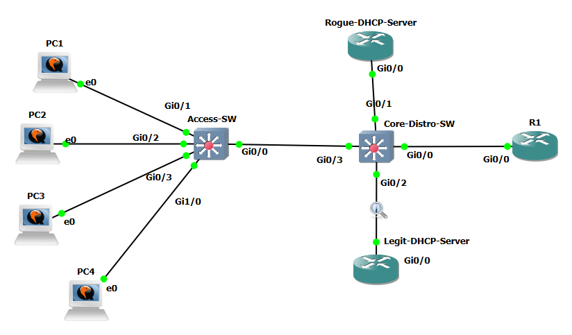
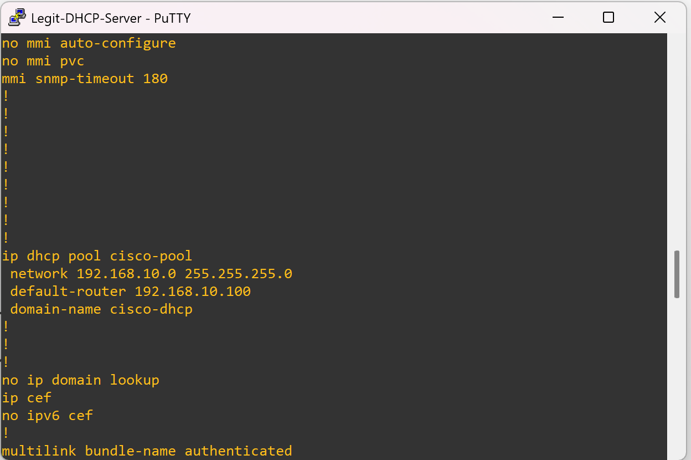
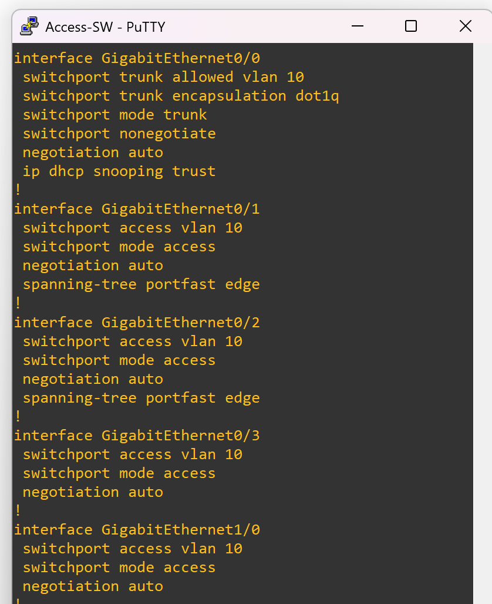
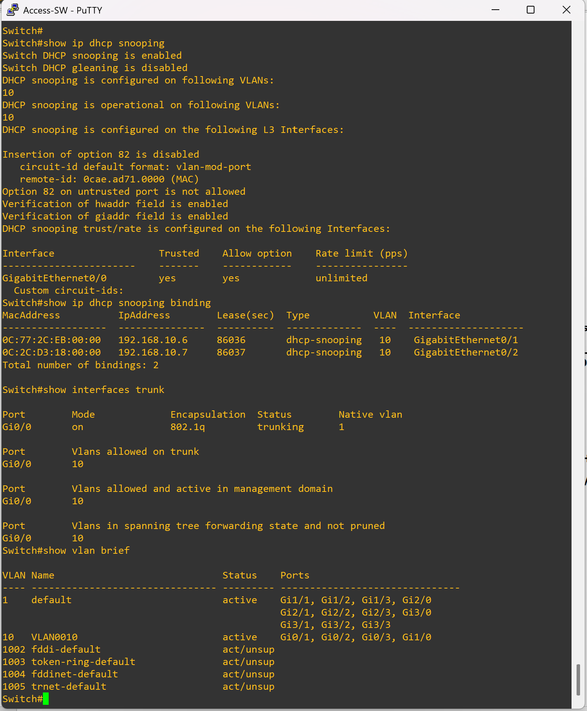
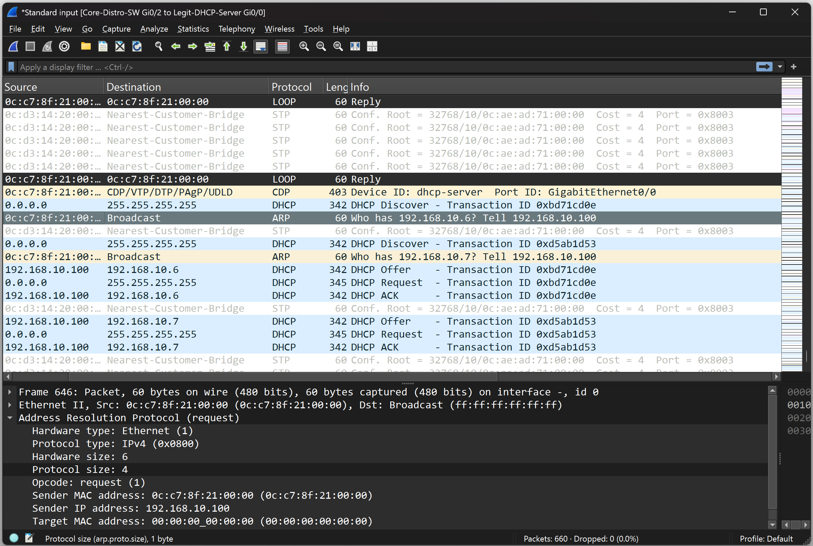
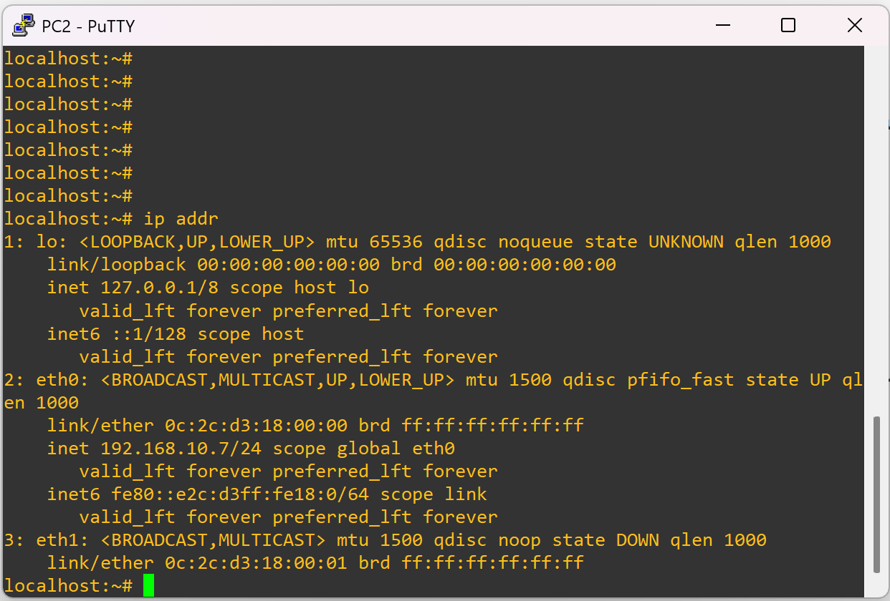
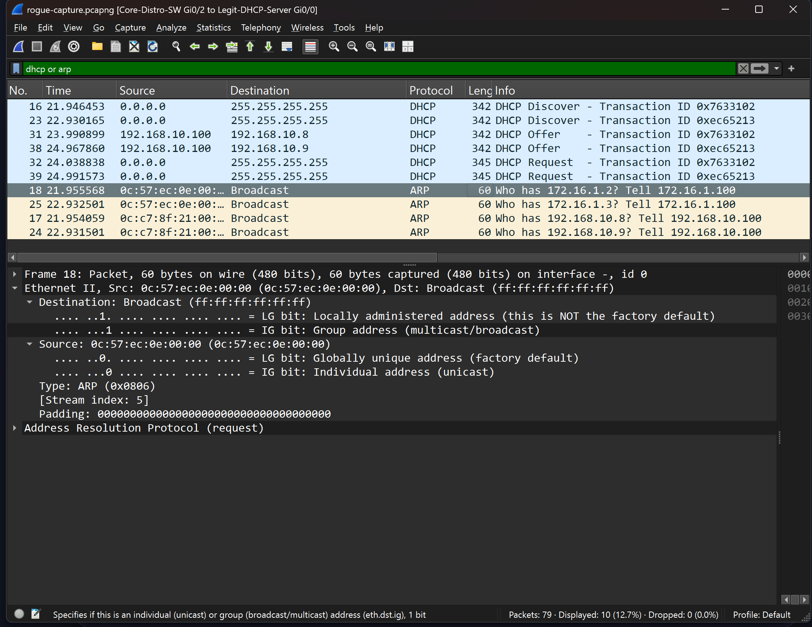
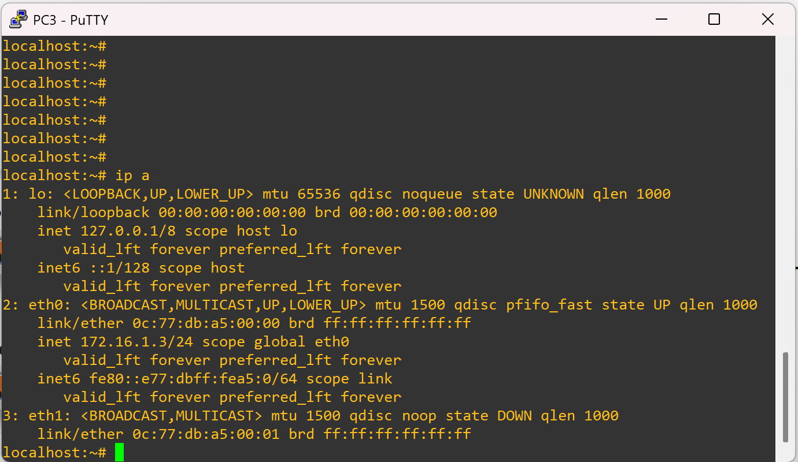

# DHCP Snooping Lab

## 📖 Overview
This repository documents a controlled lab experiment on **DHCP Snooping** using Cisco switches.  
The goal was to observe normal operation and then intentionally misconfigure snooping to see how rogue DHCP servers behave when allowed.

Two phases were tested:

- **Phase 1:** Correct configuration — only the legitimate DHCP server was trusted.  
- **Phase 2:** Intentional misconfiguration — the rogue DHCP server port (Gi0/1) was deliberately marked as trusted to study the outcome.

Verification was done using Cisco `show` commands and Wireshark packet captures.

---

## 🖥️ Topology
- **Core Switch**
  - Legitimate DHCP server (trusted port)
  - Rogue DHCP server (untrusted in Phase 1, trusted in Phase 2)
  - Trunk to Access Switch (trusted port)
- **Access Switch**
  - Uplink to Core (trusted trunk)
  - Client PCs on Gi0/1 and Gi0/2 (untrusted access ports)

---

## ⚙️ Phase 1: Correct Configuration
### Configuration Highlights
```cisco
ip dhcp snooping
ip dhcp snooping vlan 10
no ip dhcp snooping information option

! Core switch
interface Gi0/2   ! Legitimate DHCP server
 ip dhcp snooping trust

interface Gi0/3   ! Trunk to access switch
 ip dhcp snooping trust

! Access switch
interface Gi0/0   ! Uplink to core
 ip dhcp snooping trust

! Client ports (Gi0/1, Gi0/2)
! left untrusted by default
```

### Observations
- `show ip dhcp snooping binding` on the access switch displayed client bindings.
- Wireshark showed:
  - Clients sent DHCP Discover.
  - Only legitimate server’s Offer/ACK reached them.
  - Clients accepted leases and immediately sent ARP probes/announcements for their new IPs.

✅ **Result:** Only the legitimate DHCP server handed out IP addresses.

---

## ⚠️ Phase 2: Intentional Misconfiguration
### Configuration Change
The access port connected to the **rogue DHCP server (Gi0/1)** was deliberately marked as trusted:

```cisco
interface Gi0/1
 ip dhcp snooping trust
```

### Observations
- Clients sent DHCP Discover.
- Both servers responded with Offers.
- Rogue server’s Offer arrived first → clients sent DHCP Request to rogue.
- Legitimate server’s Offers were ignored.
- Wireshark showed:
  - Discover → both Offers → Request → ACK from rogue.
  - Followed by ARP broadcast from client announcing its rogue‑assigned IP.

❌ **Result:** Rogue DHCP server successfully handed out IP addresses once its port was trusted.

---

## 🔎 Lessons Learned
- DHCP snooping enforces trust boundaries but does not “prefer” servers — it simply blocks untrusted replies.
- **Marking a rogue port as trusted immediately undermines snooping.**
- Clients always accept the first valid Offer they receive.
- Wireshark is invaluable for visualizing the DHCP handshake and confirming which server “wins.”

---

## 🛠️ Useful Verification Commands
```cisco
show ip dhcp snooping
show ip dhcp snooping binding
show vlan brief
show interfaces trunk
```

---

### Network Topology



---

### Phase 1 — DHCP Config

- DHCP pool on legit server 
  

- DHCP pool on rogue server 
  

---

### Phase 2 — IP DHCP Snooping Config on Core and Access Switches

- Show Run Interface Config on Core Switch  
  

- Show commands on Core
  

- Show Run Interface Config on Access Switch  
  

- Show commands on Access  
  

---

### Phase 3 — DHCP Captures on Wireshark and IP handouts

- Packet capture of DHCP
  

- PC in VLAN 10 successfully acquired an IP 4 address 
  

- Database of IP address and MAC address pairs for devices that have successfully completed a DHCP transaction.
  

---

### Phase 4 — Intentionally Misconfiguration

- Packet capture of rogue DHCP in action
  

- PC in VLAN 10 acquired a IP 4 address from illegitimate server  
  

---

## 📌 Conclusion
This lab highlights the importance of DHCP snooping trust boundaries:
- In **Phase 1**, snooping worked as intended: rogue offers were blocked.  
- In **Phase 2**, the rogue server was intentionally trusted, showing how quickly it can take over client leases.  
- **Key takeaway:** Correct trust configuration is critical — trusting the wrong port completely defeats DHCP snooping.
