# WAN GRE over IPsec

Secure Overlay Routing over ISP Underlay

## Project Summary

This project demonstrates the design, implementation, and validation of a **secure, enterprise-style WAN architecture** using **GRE over IPsec**. The solution connects two sites across an ISP-provided network while maintaining strict separation between the physical transport layer and the routed enterprise network.

The lab was intentionally designed to support **dynamic routing over an untrusted WAN** while encrypting only the traffic that requires protection. OSPF operates exclusively within the GRE overlay, and IPsec secures the GRE traffic as it traverses the ISP underlay.

---

## Design Goals

* Demonstrate clear separation between WAN underlay and routed overlay
* Support dynamic routing across the WAN using OSPF
* Secure overlay traffic using IPsec without complicating the underlay
* Follow enterprise best practices for routing scope and security
* Validate both control plane and data plane behavior

---

## Architecture Overview

This design uses a layered approach.

### Underlay Network

The underlay represents the **physical WAN infrastructure** provided by an ISP. It consists of point-to-point /30 links connecting each site to an ISP router.

Characteristics of the underlay:

* Static routing only
* No dynamic routing participation
* No visibility into enterprise LAN networks
* Responsible solely for tunnel endpoint reachability

### Overlay Network

The overlay is a **GRE virtual tunnel interface** established between the HQ and Branch routers. This tunnel provides a logical point-to-point connection that supports routing protocols and multiple internal subnets.

Characteristics of the overlay:

* GRE encapsulation for traffic abstraction
* OSPF adjacency formed exclusively on the tunnel interface
* Dynamic route exchange between sites
* Complete isolation from the ISP routing domain

---

## Routing Strategy

OSPF is deliberately constrained to the overlay.

Key routing decisions:

* OSPF is enabled only on the GRE tunnel and LAN interfaces
* All other interfaces are configured as passive
* No OSPF adjacency forms on WAN or ISP-facing links
* LAN networks are advertised without exposing routing control traffic

This approach ensures predictable routing behavior and prevents unintended interactions with the ISP network.

---

## Security Design

GRE over IPsec

GRE provides encapsulation and routing flexibility but does not provide security. To meet **confidentiality, integrity, and authentication (CIA)** requirements, GRE is paired with IPsec.

### Encryption Scope

Only GRE traffic is encrypted.

* GRE encapsulates internal LAN traffic
* IPsec encrypts GRE packets in tunnel mode
* ISP underlay sees only encrypted ESP traffic
* Internal IP addresses, routing updates, and payloads remain hidden

This selective encryption model keeps the underlay simple while fully protecting enterprise traffic.

---

## Verification and Validation

The solution was validated using both IOS operational commands and packet-level inspection.

### Tunnel and Routing Validation

* GRE tunnel state and counters confirm tunnel stability
* OSPF neighbor relationships verify adjacency over the tunnel
* OSPF learned routes confirm dynamic exchange of LAN networks

### Security Validation

* IPsec Phase 1 and Phase 2 security associations show active encryption
* Encapsulation and decapsulation counters increase during traffic flow
* Packet capture on the ISP link confirms the absence of GRE and internal IP traffic

Wireshark captures show only ESP packets traversing the underlay, validating correct encryption behavior.

---

## Lessons Learned

This lab reinforced several important real-world networking principles.

### Underlay Reachability Is Required First

GRE tunnels do not establish reachability on their own. Both tunnel endpoints must be reachable through the underlay before the tunnel can come up. In this design, static host routes were required to reach remote tunnel endpoints through the ISP router.

### Separation of Concerns Simplifies Design

Keeping the underlay simple and moving all routing intelligence into the overlay reduced complexity and made troubleshooting more straightforward. This separation mirrors real enterprise WAN and cloud network designs.

### Interface-Level OSPF Provides Better Control

Enabling OSPF directly on specific interfaces rather than relying on broad network statements prevented accidental adjacency formation and provided precise control over routing behavior.

### Verification Matters as Much as Configuration

Operational validation using show commands and Wireshark provided confidence that the design behaved as intended. Seeing ESP traffic instead of GRE on the underlay confirmed that encryption was effective and properly scoped.

### GRE and IPsec Complement Each Other

GRE enables routing flexibility and multi-subnet support, while IPsec provides security. Together they form a scalable and secure WAN solution suitable for dynamic enterprise environments.

---

## Key Takeaways

* Overlay and underlay separation is critical in modern WAN design
* GRE enables routing and encapsulation across WANs
* IPsec secures overlay traffic without exposing internal networks
* OSPF should be tightly scoped to trusted interfaces
* Proper verification confirms both functionality and security

---

## Potential Enhancements

Future improvements to this lab could include:

* IPsec Perfect Forward Secrecy
* MTU and MSS optimization
* Dual WAN failover
* Route filtering and summarization
* Comparison with IPsec VTI based designs

---

## Final Notes

This project reflects real-world enterprise WAN patterns and emphasizes not only implementation, but also validation, documentation, and design intent. It demonstrates an understanding of layered networking, routing discipline, and security best practices.
---

Network Topology

Topology Diagram

Shows the overall WAN design, including the ISP underlay, the GRE overlay tunnel between HQ and Branch, and where IPsec is applied to protect GRE traffic over the underlay.

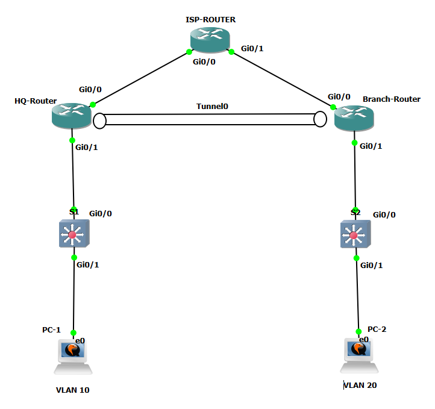

Underlay Reachability

HQ Underlay Route Check

Confirms HQ can reach the Branch tunnel endpoint across the ISP underlay using tight routing (no default route)

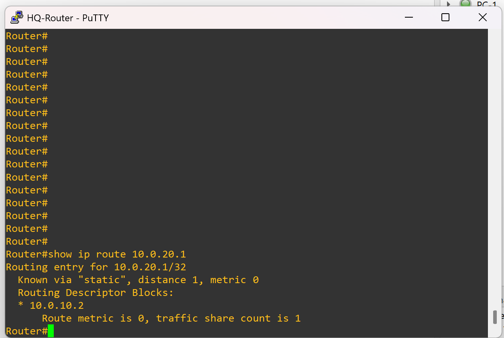

Underlay Reachability

Branch Underlay Route Check

Confirms Branch can reach the HQ tunnel endpoint across the ISP underlay using tight routing (no default route).
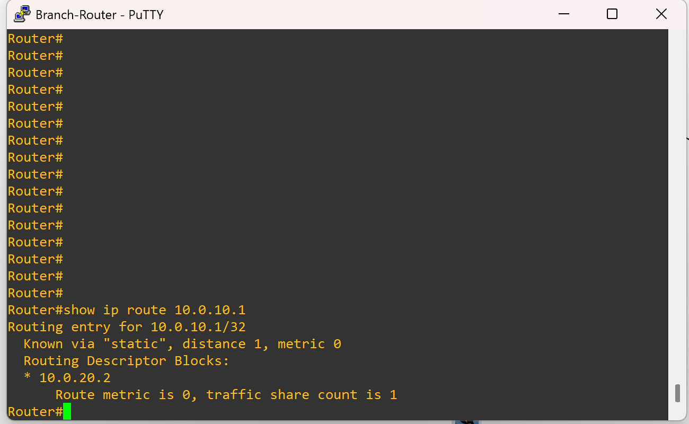

GRE Overlay Validation

GRE Tunnel Interface Status

Verifies Tunnel0 is up and passing traffic, confirming the overlay is operational on top of the underlay.
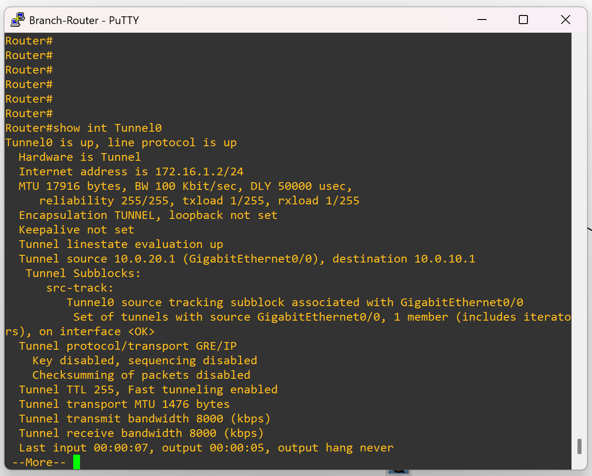

OSPF Over GRE Validation

OSPF Neighbor Adjacency

Confirms OSPF forms a neighbor relationship across the GRE tunnel and not on the WAN underlay.

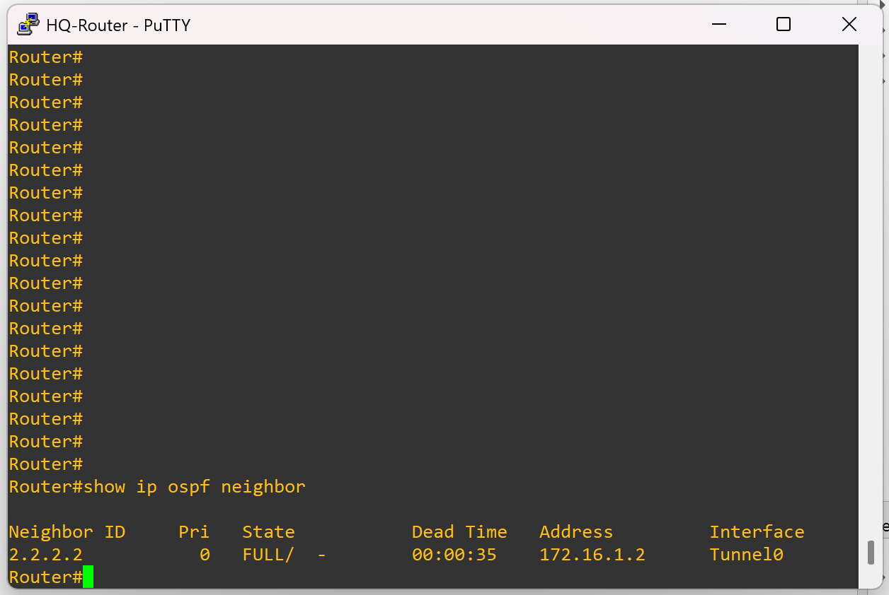

OSPF Interface Participation Summary

Validates intended OSPF behavior, showing where OSPF is enabled and helping confirm passive interface design.

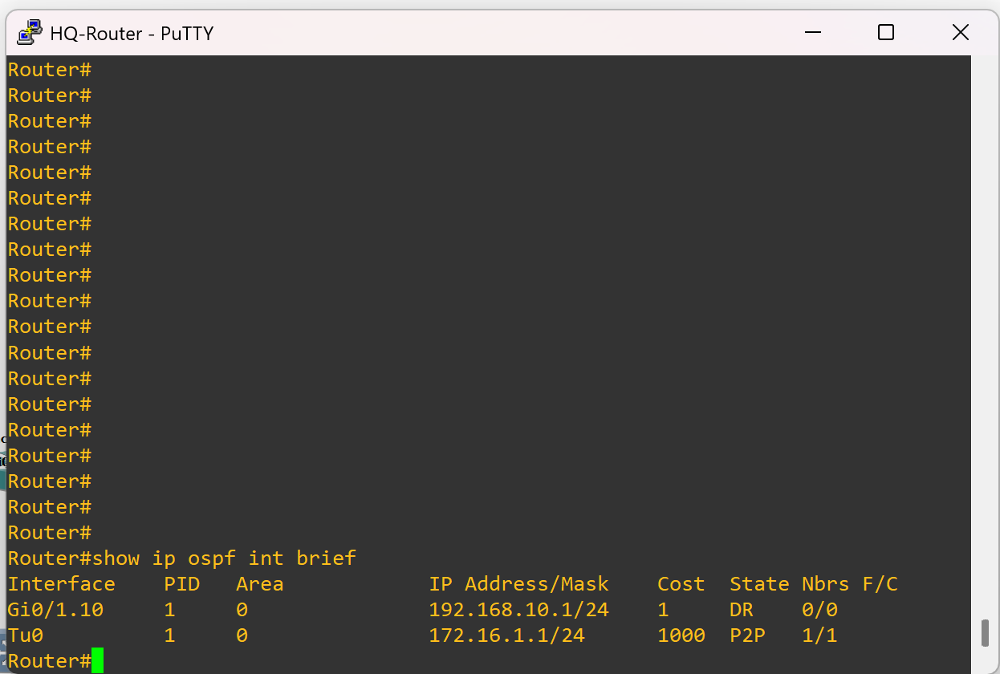

OSPF Learned Routes

Shows routes learned dynamically via OSPF over the GRE overlay, proving LAN route exchange between sites.

End-to-End Connectivity

PC Ping and Traceroute Validation

Demonstrates successful end-to-end communication between LANs and confirms traffic flow across the overlay path.

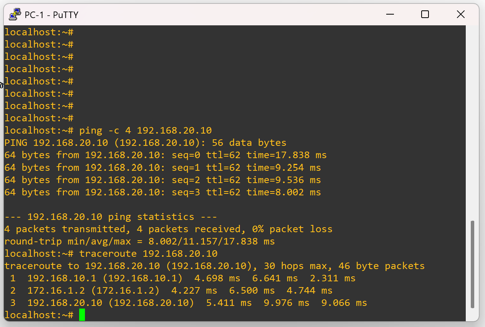

Packet Capture Validation (Reference)

GRE Encapsulation Capture

Reference packet capture showing GRE encapsulation behavior for validation and comparison purposes.

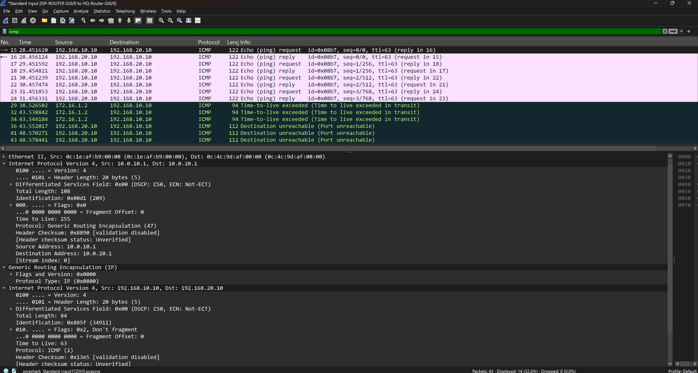

OSPF Inside GRE

Shows OSPF packets encapsulated inside the GRE tunnel, confirming the routing protocol is carried by the overlay.

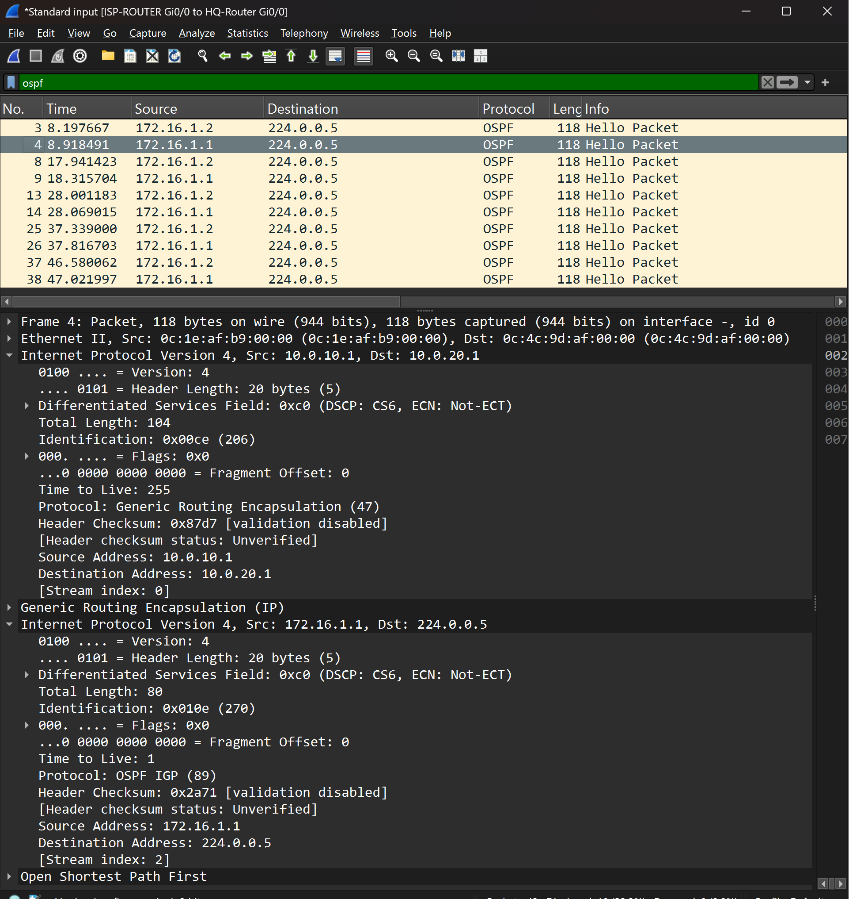

IPsec Added Toward the End of the Lab

Crypto ACL for “GRE Only” Encryption Scope
Confirms the encryption policy matches GRE traffic between tunnel endpoints, ensuring IPsec protects the tunnel traffic rather than directly encrypting LAN subnets.

ISAKMP Phase 1 Established
Validates Phase 1 negotiation and authenticated peer establishment prior to Phase 2 encryption.

IPsec Phase 2 Security Associations
Confirms active IPsec encryption of GRE traffic, typically validated by active SAs and increasing encapsulation and decapsulation counters.

ESP Observed on the Underlay
Wireshark capture showing ESP traffic on the ISP-facing link, confirming the underlay only sees encrypted packets and not internal addressing or GRE headers.

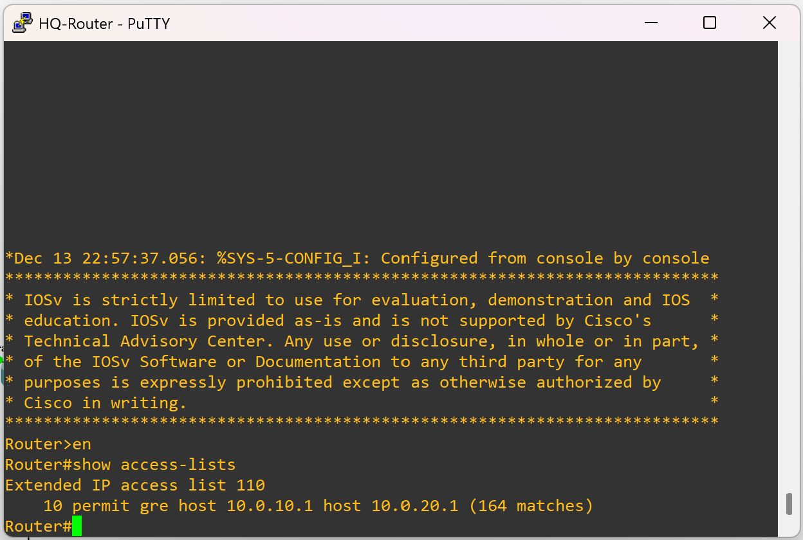

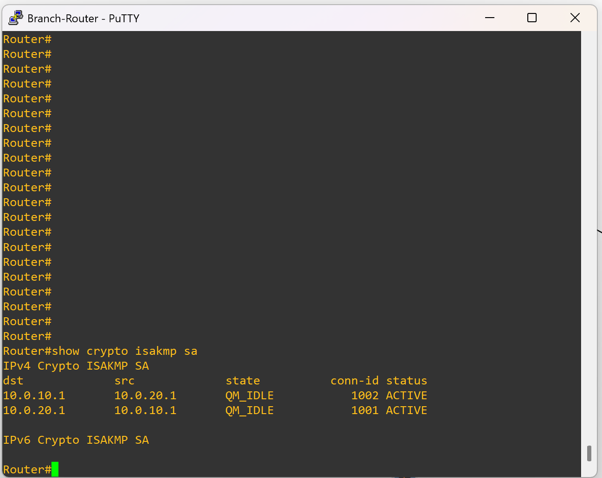

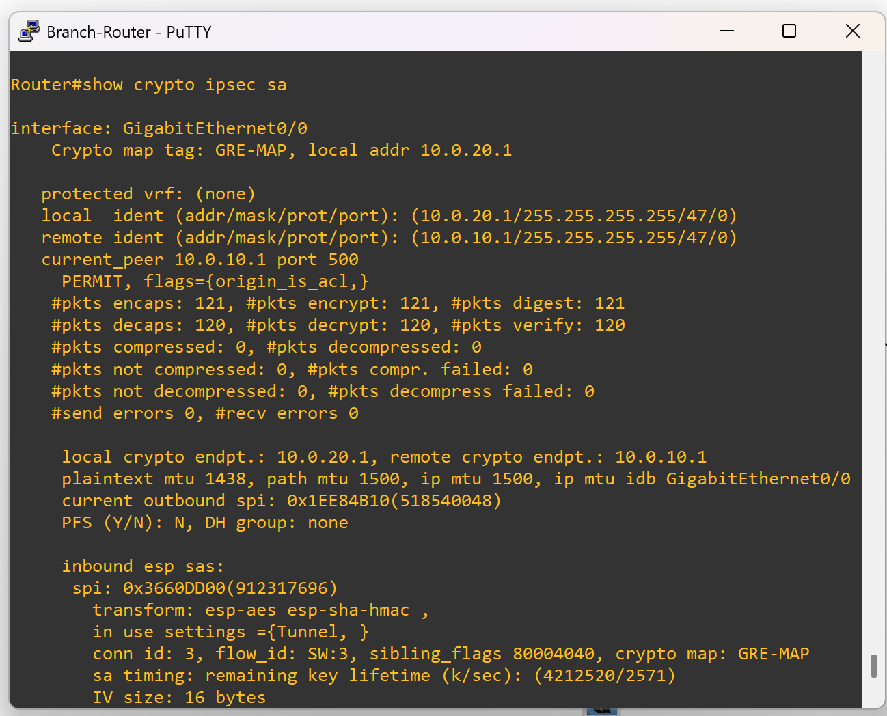

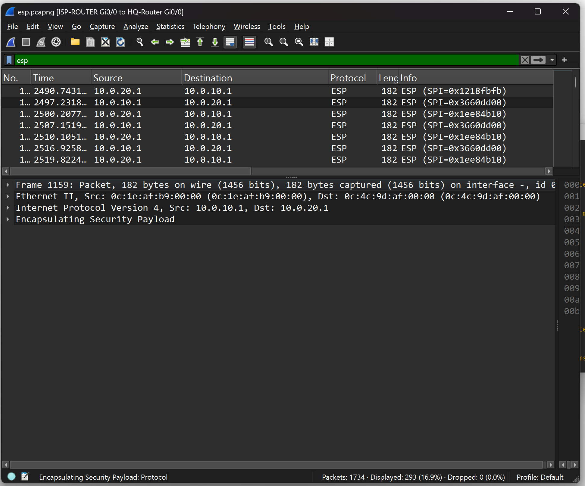

